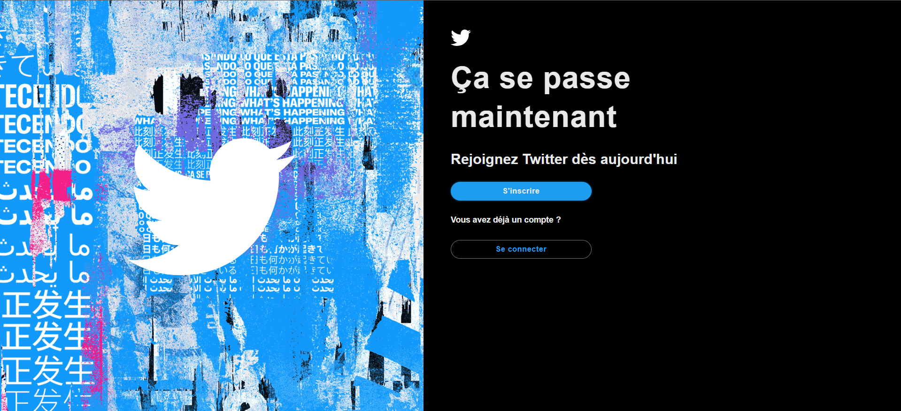
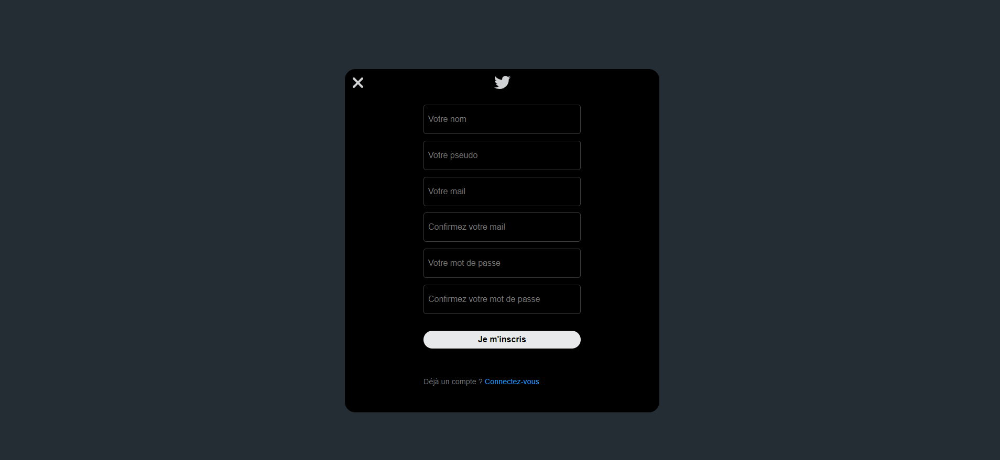
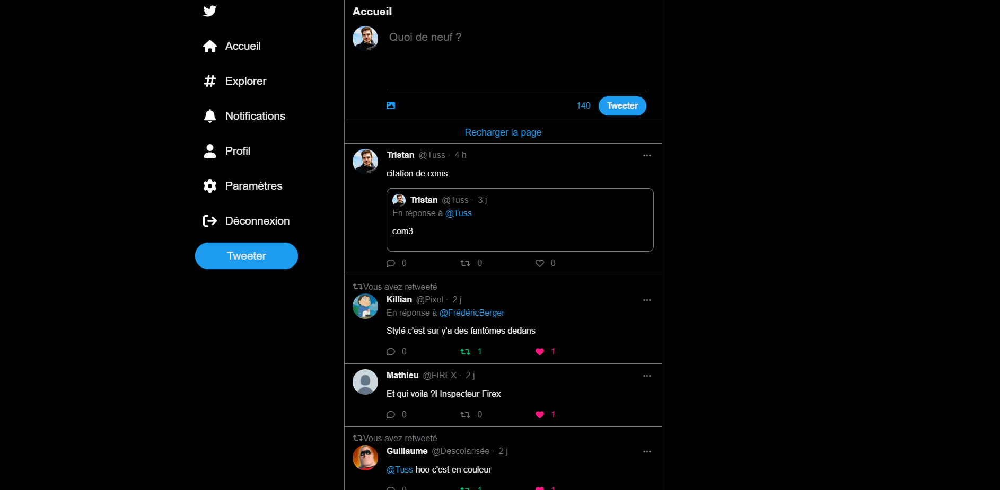
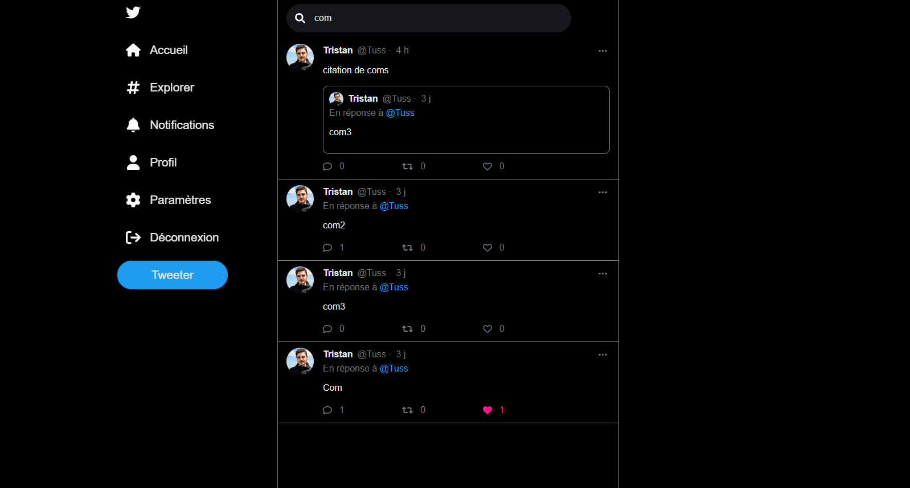
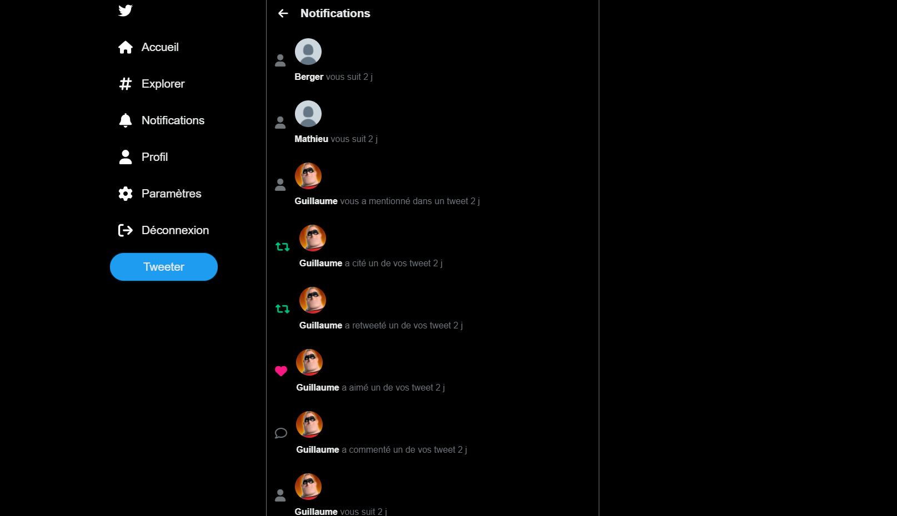
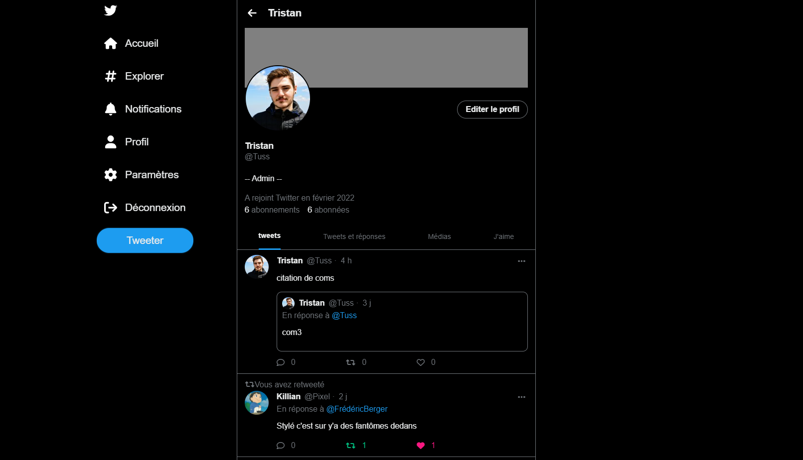
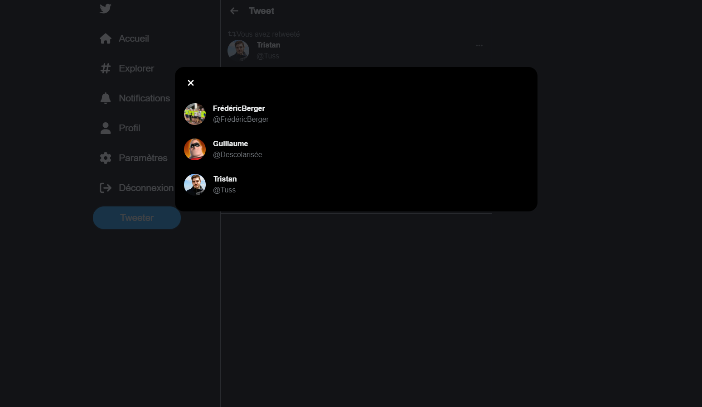
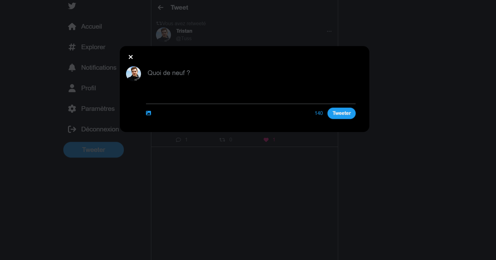

# Twitter clone - [Live preview](https://tbtweet.go.yj.fr/)

A Twitter clone built using SASS/JS/PHP/MySQL.
For more infos about the architecture of the project and database, check the architecture.md file. 
twitter_clone.sql also provide the database deployment code.

## Features
- Authentication system
- Post a tweet with or without image from any page
- Delete, like, retweet, comment and quote a tweet (comments and quotes are considered as tweets, so it's also possible to like,retweet,comment and quote them)
- Mention a user in a tweet with a @
- Follow or unfollow a user
- See the list of users following or followed by a user
- See notifications for any user following or mentioning you
- See notifications for any user liking,commenting or quoting one of your tweet
- Update your profile (name, username, bio, cover image, profile image)
- Update your email and password
- Search for a tweet or a user by doing a filtered search

## Preview

### Index

### Sign Up

### Sign In

### Home

### Explore

possibility to look for a user instead of a tweet, suggestions are displayed after writing @

### Notifications

### Profile

a modal to update your profile

### Followers/Followed

### Settings

### Status

modal to see who liked or retweeted your tweet

### Modal tweet

possibility to mention a user, suggestions are displayed after writing a @

### Modal comment

### Modal quote
